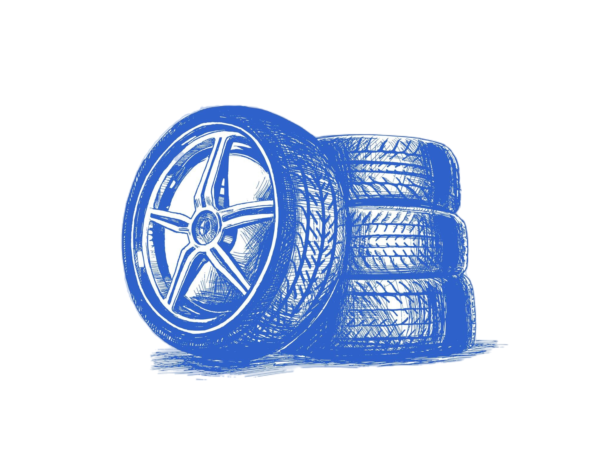

<div align='center'>
    <h1><b>👑 [Ecommerce - Neumaticos Rulo] 👑</b></h1>
    
    <p>En este proyecto se realizó un ecommerce de venta de neumaticos</p>


</div>

<br />

---

## 🗒️ **INSTALLATION**

### local installation:

1. clone the repo

```
git clone https://github.com/LucasParedes/Ecommerce-react-coder.git
```

2. cd into cloned repo

```
cd <repo>
```

3. install dependencies

```
npm install
```

4. run the app

```
npm run dev
```

<br />

---
