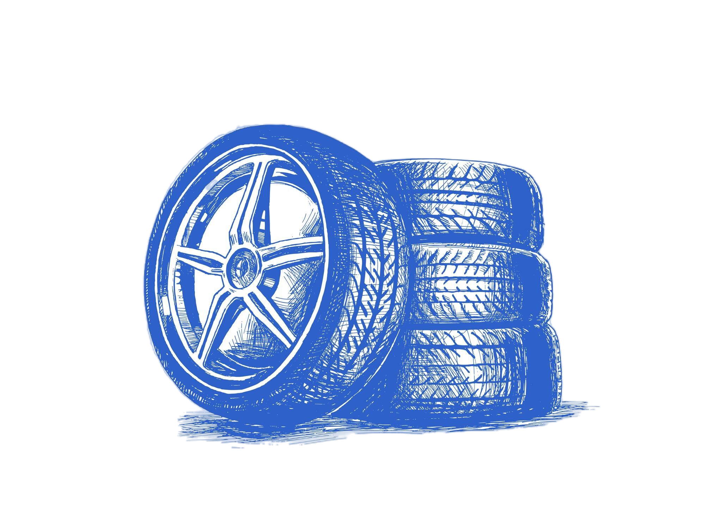

<div align='center'>
    <h1><b>👑 [Ecommerce - Neumaticos Rulo] 👑</b></h1>
    
    <p>En este proyecto se realizó un ecommerce de venta de neumaticos</p>


</div>

<br />

---

## 🗒️ **INSTALLATION**

### local installation:

1. clone the repo

```
git clone https://github.com/LucasParedes/Ecommerce-react-coder.git
```

2. cd into cloned repo

```
cd <repo path>
```

3. install dependencies

```
npm install
```

4. run the app

```
npm run dev
```

<br />

---

## 🏆​ **QUE SE REALIZO**

- Agregar una Base de datos (Firebase) para que almacene mis productos.
- Consultar de la misma BD mis productos.
- Dependiendo la categoria que se seleccione muestra solo esos productos.
- El cliente solo puede sumar al carrito el máximo del stock que haya por producto.
- En el carrito cuando el cliente disminuya la cantidad del producto y queda en 0, se elimina el producto.
- Una vez seleccionado los productos se guarda en el LocalStorage, manteniendolos siempre.
- Una vez finalizada la compra se cambia el stock del producto en la BD y se actualiza en el front con el nuevo stock disponible.

### **Siguiente contenido**

- Realizar un registro/login en la APP.
- Poder realizar una compra realmente con Mercado Pago.
- Poder hacer perfiles.
- Muchas otras cosas :D
